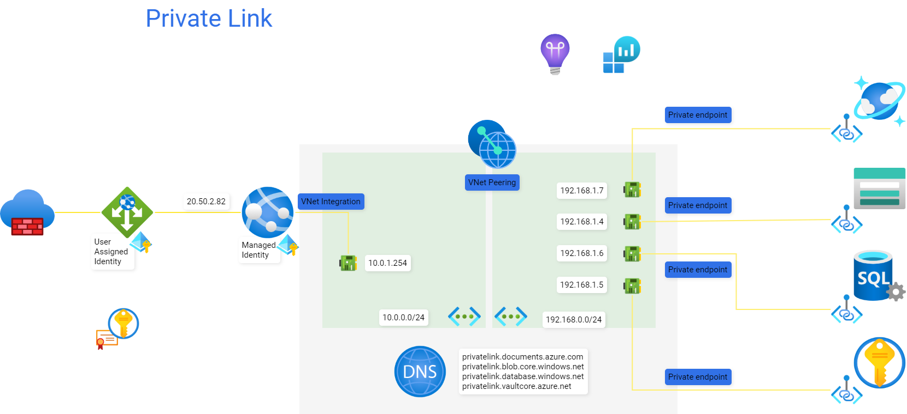

# Azure Private Link

## Introduction

This repository contains all terraform scripts used to deploy Azure dedicated items of infrastructure needed by the `Private Link` service.

Here you can see all resources deployed by **IaC**:


## Getting Started

1. Clone Git repository on your local computer
2. Use Visual Studio Code to open local directory
3. Install some extensions on VS Code:

   - Azure Pipelines (by Microsoft)
   - Azure Terraform (by Microsoft)
   - HashiCorp Terraform (by HashiCorp)
   - Terraform (by Anton Kulikov)

## Build, Test & Deploy

In the pipelines folder you can find all `yaml`'s definitions use to build, test & deploy all Terraform script using Azure DevOps platform.

`Checkov` is used for a static code analysis, it scans cloud infrastructure provisioned using Terraform, Terraform plan, Cloudformation, Kubernetes, Dockerfile, Serverless or ARM Templates and detects security and compliance misconfigurations using graph-based scanning.

## Contribute

You must create a new branch for each new feature you develop, instead of just checking in all your changes into the main branch.

Here are the basic steps to start using feature branches :

1. Start on main

   ```bash
   # switch to the main branch
   git checkout main
   # fetch the latest changes from the remote git repository
   git pull origin main
   ```

2. Create a new feature branch

   ```bash
   git checkout -b new_feature
   ```

   This will create a new branch called `new_feature` and check it out. We can think of this new branch as a copy of `main`, because it was what we had checked out, and it keeps the contents just as they were. We can now make new changes in our new branch without affecting the main branch.

   We could argue about branch naming practices, but so far I haven’t found naming to be that big of an issue.

   ```bash
   git status
   ```

3. Implement your changes on that branch

   Now, we implement the new feature / bug fix. Work as you would normally, making small incremental changes and checking them into the local feature branch.

   Use descriptive comments when adding new changes so the history of changes is easy to follow. They can still be short and succinct, but be clear.

   One useful way to think about commit messages is that together they make up the recipe for your project. `"Add Key Vault terraform definition"` or `"Add Checkvov step in the build validation pipeline"` are very clear explanations for what your code is doing.

4. Push the feature branch to your remote repo

   Ok, you are done with the implementation. You’ve checked and double checked the changes, and you are now ready to have them integrated into the main code base.

   The first step of the review process is to push your feature branch to `origin`.

   ```bash
   git push origin new_feature
   ```

   This will push your current branch to a new branch on `origin` with the same name.

   Of course, you can do this multiple times during the development process if you want the peace of mind of having your changes distributed, or if you want another set of eyes on it even before the pull request.

5. Create a pull request for your new changes

   With your feature branch now pushed, navigate to the project’s Azure DevOps page. On the main page, you should see a new little toolbar that shows your feature branch listed and asks if you want to `create a pull request` from it.

   > ## So let’s do it !
